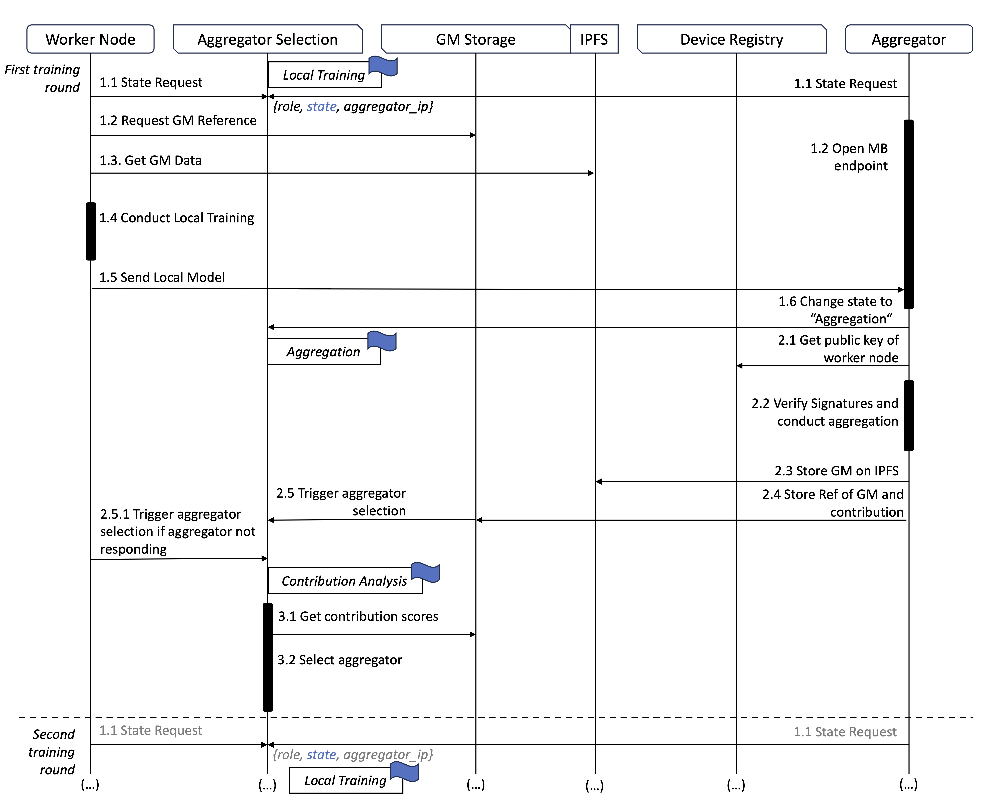

# Proof of concept implementation: Practical Verifiable Decentralized Federated Learning with TEEs

### Advancing the Efficiency of Decentralized Federated Learning

The folders represent different components of the MVP.

- Cloud setup: Terraform configuration files and Ansible automations.
- Neural Network: ANN with additional FedAvg algorithm.
- Node Server: Logic for the components inside the edge devices.
- Remote attestation Code: zkVM-based remote attestation.
- Smart Contract: Foundry Project including all smart contracts and interfaces.




 
# Setup

### Install Rust on Mac
```
curl --proto '=https' --tlsv1.2 -sSf https://sh.rustup.rs | sh                
```
Load it oder restart your terminal.
```
source $HOME/.cargo/env
```
### Install rics zero on Mac
```
curl -L https://risczero.com/install | bash
```
```
rzup install
```
### Install Foundry Toolbox (Anvil included) on Mac
``` 
curl -L https://foundry.paradigm.xyz | bash
```
```
foundryup
```
### Start a private test blockchain with 
```
anvil
```

# neural network

Change into the neural_network folder.

To simulate 3 rounds of training the federated averag.

```
./start.exe simulate
```
To train one round.
```
./start.exe train 30 
```
To start the zerompq server.
```
./start.exe server
```
To start the clients.
```
./start.exe client * 1
```
To calculate the federated average.
```
./start.exe aggregate 3
```

### Functionality of the neural network
- AES global model encryption and decryption is simulated
- RSA signature verification with SHA 256, all clients sign with the same key

# smart contract

Create a new .env file in the node_server folder.
```
ETH_WALLET_PRIVATE_KEY= ask me
```


You can deploy contracts with forge.
```
forge script script/Deploy.s.sol --rpc-url https://eth-sepolia.g.alchemy.com/v2/wW26nTnOFYHR-x3-awqwF5FwWaHAiLe5 --broadcast --legacy 
```


# node server

Create a new .env file in the node_server folder.
```
# Your IPFS PINATA Settings
API_KEY=
API_SECRET=
PINATA_JWT=
IPFS_GATEWAY=

# Your Alchemy Sepolia URL
SEPOLIA_RPC_URL=

# Smart Contract Address
AGGREGATOR_ADDRESS=0x299e2c907A9f00b9a23E828765d3A8a72fbFac37 
# smart_contract/src/AggregatorSelection.sol

GM_STORAGE_ADDRESS=0x4a2a781146A86e57247A9dBfb18e76bEEA6c10cD
# smart_contract/src/GMStorage.sol 

REGISTRY_ADDRESS=0x3507E0d0a6001031B0b35aB912bd5135fe5EAFA1 
# smart_contract/src/DeviceRegistry.sol

# Blockchain Account
ACCOUNT_ADDRESS=0x6004D395731f85938177d5B07aCfEc2D5D7ECcB0
PRIVATE_KEY= Ask me

```

- Register on Alchemy for the *SEPOLIA_RPC_URL*
- Register on pinata for the *API_KEY**, *API_SECRET*, ‚*PINATA_JWT* and *IPFS_GATEWAY*. 

To run the server:

```
npm run start
```